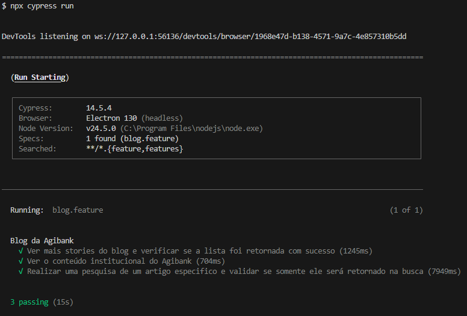
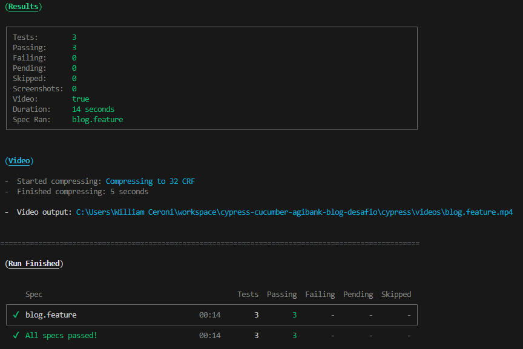

# 📌 Automação E2E – Blog Agibank  
Automação de testes end-to-end (E2E) utilizando **Cypress** e **Cucumber (BDD)** para validar cenários funcionais no [Blog do Agibank](https://blog.agibank.com.br/).  

## 🚀 Tecnologias  
- [Cypress](https://www.cypress.io/) – Framework de testes E2E  
- [Cucumber](https://cucumber.io/) – Escrita de cenários em Gherkin  
- [Node.js](https://nodejs.org/) – Ambiente de execução  
- [GitHub Actions](https://github.com/features/actions) – Integração Contínua (CI/CD)  

---

## 📂 Estrutura do Projeto  
```
📦 cypress-cucumber-agibank-blog-desafio
 ┣ 📂 .github                # Yml para integração no Github Workflows para CI/CD
 ┣ 📂 cypress
 ┃ ┣ 📂 integration          # Testes E2E em .feature
 ┃ ┃ ┣ 📂 features           # Cenários em BDD
 ┃ ┣ 📂 plugins              # Hospeda o index para inicializção do projero 
 ┃ ┣ 📂 screenshots          # Armazena prints de falhas durante a execução
 ┃ ┣ 📂 support              # Scripts de automação
 ┃ ┃ ┣ 📂 steps              # Step Definitions em JavaScript/TypeScript para contemplar os cenários em BDD
 ┃ ┃ ┣ 📂 pages              # Estruração do código em Page Object Model
 ┃ ┣ 📂 videos               # Armazena vídeos de todas execuções
 ┣ 📜 cypress.config.ts
 ┣ 📜 package-lock.json
 ┣ 📜 package.json
 ┣ 📜 README.md
```

---

## 🧪 Cenários Automatizados  
Alguns exemplos implementados no Blog do Agibank:

- 🔍 **Busca de conteúdo**  
  - Abrir a lupa no header e validar campo de busca.  
  - Pesquisar por termos específicos e validar resultados.  

- 📄 **Validação de sessões**  
  - Conferir se o título da página de resultados contém o termo pesquisado.  
  - Acessar itens do menu principal.  

*(novos cenários podem ser adicionados seguindo o padrão BDD em Gherkin)*

---

## ⚙️ Configuração do Ambiente  

### 1. Pré-requisitos  
- Node.js **v20+**  
- NPM  

### 2. Instalação  
```bash
git clone https://github.com/WilliamRuiz/cypress-cucumber-agibank-blog-desafio.git
cd cypress-cucumber-agibank-blog-desafio
npm install
```

---

## ▶️ Como Executar  

### Rodar todos os testes no Chrome (headless):  
```bash
npx cypress run
```

### Rodar interface interativa (modo GUI):  
```bash
npx cypress open
```
### Os resultados via terminal




---

## 📊 Relatórios  

- **Screenshots & Videos**: Gerados automaticamente em falhas (`cypress/screenshots` e `cypress/videos`).  
- (opcional) **Allure Report**: pode ser habilitado se configurado no projeto.  

---

## 🔄 Integração Contínua (CI/CD)  
O projeto roda automaticamente via **GitHub Actions** em:  
- Push ou Pull Request para `main` ou `develop`.  
- Resultados com relatórios e artefatos (screenshots/videos).  

Arquivo de workflow: `.github/workflows/tests.yml`  

---

## 🤝 Contribuição  
1. Crie uma branch para sua feature:  
   ```bash
   git checkout -b feature/nova-feature
   ```  
2. Adicione testes em `.feature` e `steps/`.  
3. Abra um Pull Request.  